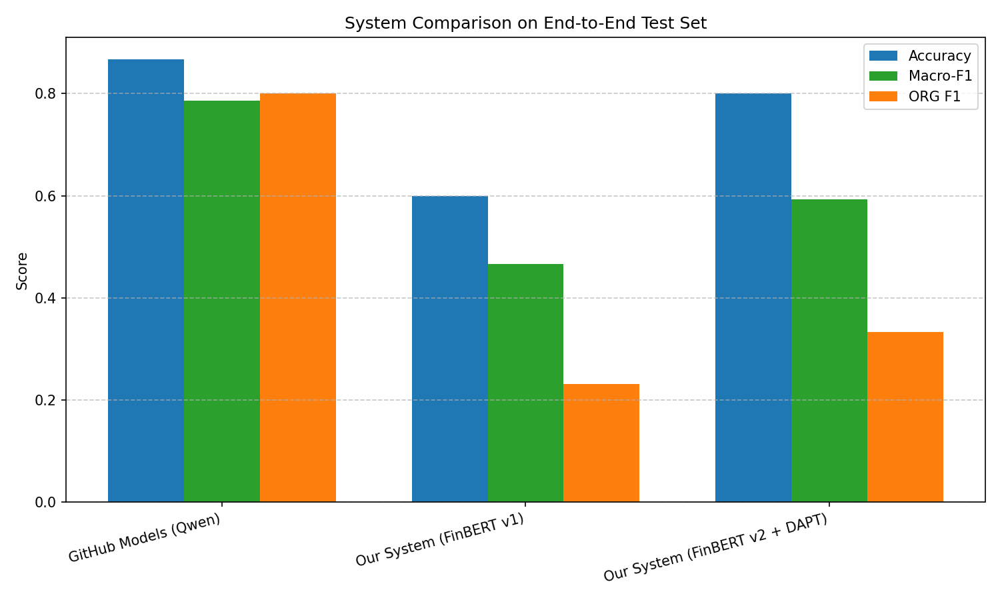

# Financial Risk Alert System

A multi-stage NLP pipeline that detects financial risks from news articles and generates reliable, context-aware alerts with extracted organization entities.

[](LICENSE)
[](https://python.org)

## 🚀 Features

- **SBERT-based Clickbait Filter**: Discards articles where the headline doesn't match the body using cosine similarity.
- **FinBERT Risk Classifier (v2)**: Fine-tuned on Financial PhraseBank and augmented with 51k Yahoo Finance articles, plus domain-adaptive pretraining (DAPT) on 160k+ news articles.
- **CRF Named Entity Recognition**: Extracts organization names (ORG) from high-risk news using a CRF model trained on CoNLL-2003.
- **LLM-powered Alert Generation**: Uses GitHub Models API (free tier) to produce natural, zero-hallucination alerts with fallback to template.
- **Web Article Parser**: Automatically extracts title and body from news URLs (CNN, BBC, Reuters, etc.) with manual fallback.
- **Interactive & Batch Modes**: Run single article demos or batch evaluate system variants.

## 📦 Installation

1. Clone the repository:
   ```bash
   git clone https://github.com/Lucktaken/630project.git
   cd 630project
   ```

2. Create and activate a virtual environment:
   ```bash
   python -m venv venv
   venv\Scripts\activate   # On Windows
   source venv/bin/activate  # On macOS/Linux
   ```

3. Install dependencies:
   ```bash
   pip install -r requirements.txt
   ```

4. (Optional) Set up GitHub Models API for LLM alerts:
   - Place your GitHub Personal Access Token in `github_token.txt`, or
   - Set the environment variable `GITHUB_TOKEN`.

## 🧪 Quick Demo

Run the interactive pipeline with automatic URL parsing or manual input:

```bash
python scripts/run_demo.py
```

**Example session:**
```text
Enter news URL (or press Enter to input manually): https://www.cnn.com/2026/04/11/business/high-inflation-rate-problem

✅ Successfully parsed:
Title: Uncomfortably high inflation is a real problem and it's not going away anytime soon

============================================================
RISK ALERT DEMO
============================================================
Title: Uncomfortably high inflation is a real problem and it's not going away anytime soon
SBERT Similarity: 0.619 (Passed: True)
Risk: High Risk (conf: 0.986)
Alert Triggered: True

ALERT MESSAGE:
**Risk Alert: High Risk**
**Confidence: 0.99**
**Affected Organizations:** Commerce Department, Federal Reserve, PNC Financial

**Alert:** Uncomfortably high inflation is persisting in the US economy, with prices surging and no immediate resolution in sight. This poses significant risks to the financial stability of the affected organizations.
============================================================
```

## 📊 System Comparison

We provide an end-to-end evaluation script comparing three system configurations on a 50-article 2026 financial news test set:

- **GitHub Models (Qwen)** — general-purpose LLM baseline
- **Our System (FinBERT v1)** — base modular pipeline
- **Our System (FinBERT v2 + DAPT)** — domain-pretrained variant with expanded data

Run the comparison:

```bash
python scripts/compare_systems.py
```

This will output detailed metrics and generate a bar chart in `assets/system_comparison_bar.png`.



*Key findings: v2 with DAPT and Yahoo augmentation achieves the highest accuracy, Macro-F1, and ORG F1, validating the benefits of domain adaptation and data diversity.*

## ⚙️ Configuration

To suppress verbose warnings and progress bars during demos, the following environment settings are applied in the scripts:

```python
warnings.filterwarnings("ignore")
os.environ["HF_HUB_DISABLE_SYMLINKS_WARNING"] = "1"
os.environ["TOKENIZERS_PARALLELISM"] = "false"
os.environ["TRANSFORMERS_VERBOSITY"] = "error"
os.environ["HF_HUB_VERBOSITY"] = "error"
os.environ["HF_HUB_DISABLE_PROGRESS_BARS"] = "1"
os.environ["TQDM_DISABLE"] = "1"
os.environ["SENTENCE_TRANSFORMERS_SILENT"] = "1"
```

**Comment out these lines if you encounter any issues downloading or loading models.** They only affect console output and do not change functionality.

## 📁 Repository Structure

```text
.
├── README.md
├── requirements.txt
├── .gitignore
├── assets/                     # Figures and training curves
│   └── system_comparison_bar.png
├── models/                     # Small serialized models
│   └── crf_org_extractor.pkl
├── notebooks/                  # Jupyter notebooks for training & experiments
├── scripts/
│   ├── run_demo.py             # Interactive single-article demo
│   ├── compare_systems.py      # Batch evaluation across system variants
│   └── download_data.py        # (Optional) dataset download helper
├── src/                        # Core Python modules
│   ├── sbert_filter.py
│   ├── finbert_classifier.py
│   ├── crf_extractor.py
│   ├── pipeline.py
│   ├── web_parser.py
│   ├── llm_alert_generator.py
│   └── utils.py
├── test_articles_2026.json     # 50-article evaluation set (2026 news)
└── github_token.txt            # (Ignored by git) GitHub API token
```

## 🤖 Models

| Component | Model / Path | Description |
| :--- | :--- | :--- |
| **Risk Classifier (v2)** | [`xuyifei1234/finbert-risk-classifier-v2`](https://huggingface.co/xuyifei1234/finbert-risk-classifier-v2) | FinBERT + DAPT + Yahoo augmentation (3-class) |
| **Risk Classifier (v1)** | [`xuyifei1234/finbert-risk-classifier`](https://huggingface.co/xuyifei1234/finbert-risk-classifier) | Baseline FinBERT fine-tuned on PhraseBank only |
| **CRF Extractor** | `models/crf_org_extractor.pkl` | CRF model trained on CoNLL-2003 (ORG entities) |
| **SBERT** | `all-MiniLM-L6-v2` | Off-the-shelf sentence transformer (auto-download) |
| **LLM Alert Generator** | GitHub Models (GPT-4o-mini / Qwen) | Free API, falls back to template on error |

## 📚 Datasets

The following datasets were used for training, calibration, and evaluation. They are not included in the repository but are documented with their sources:

| Dataset | Task | Size (approx.) | Source |
| :--- | :--- | :--- | :--- |
| Financial PhraseBank | Risk Classification | 4,840 sentences | [Hugging Face](https://huggingface.co/datasets/financial_phrasebank) |
| Yahoo Finance News | Risk Classification (augmentation) | 51,272 articles | [GitHub](https://github.com/FelixDrinkall/financial-news-dataset) |
| Webis-Clickbait-17 | Denoising (calibration) | 38,517 pairs | [Zenodo](https://zenodo.org/record/5530410) |
| CoNLL-2003 | Event Extraction (NER) | 300k+ tokens | [Hugging Face](https://huggingface.co/datasets/conll2003) |
| CNN / Common Pile News | Domain-Adaptive Pretraining | 160,000+ articles | [CNN](https://huggingface.co/datasets/AyoubChLin/CNN_News_Articles_2011-2022) / [Common Pile](https://huggingface.co/datasets/common-pile/news_filtered) |
| NewsAPI Stream | Real-time Inference | 500 articles (sampled) | [NewsAPI](https://newsapi.org/) |
| 2026 Test Set (manual) | End-to-end evaluation | 50 articles | Included as `test_articles_2026.json` |

## 🙏 Acknowledgements

- [Hugging Face Transformers](https://github.com/huggingface/transformers)
- [Sentence-Transformers](https://github.com/UKPLab/sentence-transformers)
- [sklearn-crfsuite](https://github.com/TeamHG-Memex/sklearn-crfsuite)
- [newspaper3k](https://github.com/codelucas/newspaper)
- [GitHub Models](https://github.com/marketplace/models)
- Financial PhraseBank, Yahoo Finance News, Webis-Clickbait-17, CoNLL-2003